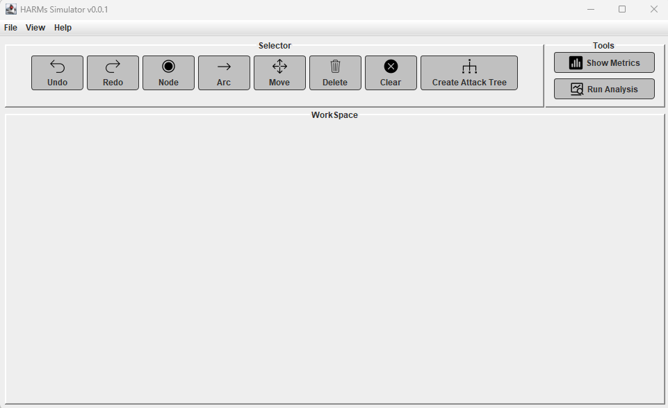

# HARMs
Graphical User Interface for HARMs

## Description
-	This is a GUI tool for HARMs written based on Java SWT. The tool support graph-based attack models in HARMs. It also provides security analysis using HARMs Engine.


 
## Features
-	Add nodes
-	Add arcs
-	Move nodes or arcs
-	Delete nodes or arcs
-	Undo and redo functions
-	Clear all
-	Save and load data
-	Analayze data

## Installation
### If you don't want to install JDK<br />
1. Install HARMs Engine at https://github.com/whistlebee/harmat<br />
2. Downalond <a id="raw-url" href="https://raw.githubusercontent.com/Naehyung/HARMs/master/HARMs.exe">HARMs.exe</a><br />
3. Run it by double click HARMs.exe
### If you have installed the JDK<br />
1. Install HARMs Engine at https://github.com/whistlebee/harmat<br />
2. Download and Run the program from command line
```java
git clone https://github.com/Naehyung/HARMs
cd HARMs
mvn package
cd target
java -jar HARMs-0.0.1.jar
```
