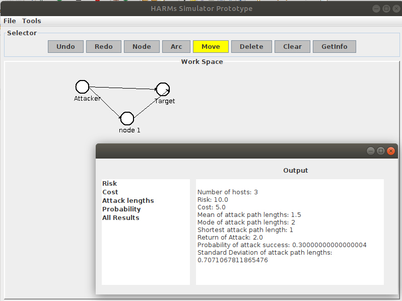
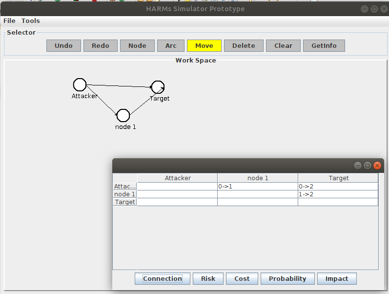

# HARMs
Graphical User Interface for HARMs

## Description
-	This is a GUI tool for HARMs written based on Java SWT. The tool support graph-based attack models in HARMs. It also provides security analysis using HARMs Engine.


 
## Features
-	Add nodes
-	Add arcs
-	Move nodes or arcs
-	Delete nodes or arcs
-	Undo and redo functions
-	Clear all
-	Save and load data
-	Analayze data

## How to use
- Use the top menu option to draw Attack Graph
- Right click on the nodes to set an Attacker and Target
- Right click on the arc to set all vulnerabilities 
- Run analysis or metrics

## Usage Examples
- Analysis<br />

- Metrics<br />


## Installation
1. Install HARMs Engine at https://github.com/whistlebee/harmat<br />
   Note: You will need Ubuntu 18.04 or any linux distros that support python 3.5 or 3.6 for HARMs Engine to work.
2. Choose “releases”
   - download "harmat-2.0-cp35-cp35m-linux_x86_64.whl" if you using python3.5
   - download "harmat-2.0-cp36-cp36m-linux_x86_64.whl" if you using python3.6
3. Go to the directry where you had download the file, run
    - $ sudo pip3 install "file name"
    - "file name" is which file you have downloaded
4.     
```java
git clone https://github.com/quocdat402/HARM_GUI.git
cd HARM_GUI
mvn package
cd target
java -jar HARMs-0.0.1.jar
```
