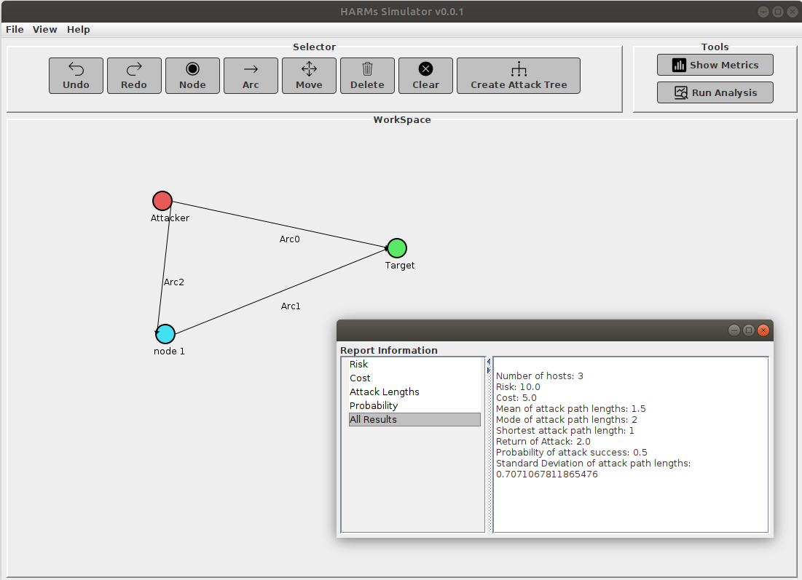

# HARMs
Graphical User Interface for HARMs

## Description
-	This is a GUI tool for HARMs written based on Java SWT. The tool support graph-based and tree-based attack models in HARMs. It also provides security analysis for attack graph using HARMs Engine.


 
## Features
-	Add nodes
-	Add arcs
-	Move nodes or arcs
-	Delete nodes or arcs
-	Undo and redo functions
-	Clear all
-	Save and load data
-	Analayze data
-  Create attack tree

## How to use the attack graph
- Use the top menu option to draw Attack Graph
- Right click on the nodes to set an Attacker and Target
- Right click on the arc to set all vulnerabilities 
- Run analysis or metrics

## How to use the attack tree
Attack tree is generated from text.

In the text area, define the structure of the attack tree using the following format:

- Each line represents a node in the attack tree.
- The level of a node is determined by the number of leading equals signs (=) before the node text.
- The root node should have only one leading equals sign (=).
- Child nodes should have more leading equals signs than their parent node.
- Optional: You can specify the gate type (AND or OR) at the beginning of a node's text, separated by a space.

Example attack tree text:

=Root Node

==AND Child Node 1

===Grandchild Node 1.1

===Grandchild Node 1.2

==OR Child Node 2

===Grandchild Node 2.1

===Grandchild Node 2.2

After entering the attack tree structure, click on the "Generate Tree" button.

## Usage Examples
- Analysis<br />

- Metrics<br />


## Installation
1. Install HARMs Engine at https://github.com/whistlebee/harmat<br />
   Note: You will need Ubuntu 18.04 or any linux distros that support python 3.5 or 3.6 for HARMs Engine to work.
2. Choose “releases”
   - download "harmat-2.0-cp35-cp35m-linux_x86_64.whl" if you using python3.5
   - download "harmat-2.0-cp36-cp36m-linux_x86_64.whl" if you using python3.6
3. Go to the directry where you had download the file, run
    - $ sudo pip3 install "file name"
    - "file name" is which file you have downloaded
4.     
```java
git clone https://github.com/quocdat402/HARM_GUI.git
cd HARM_GUI
mvn package
cd target
java -jar HARMs-0.0.1.jar
```
